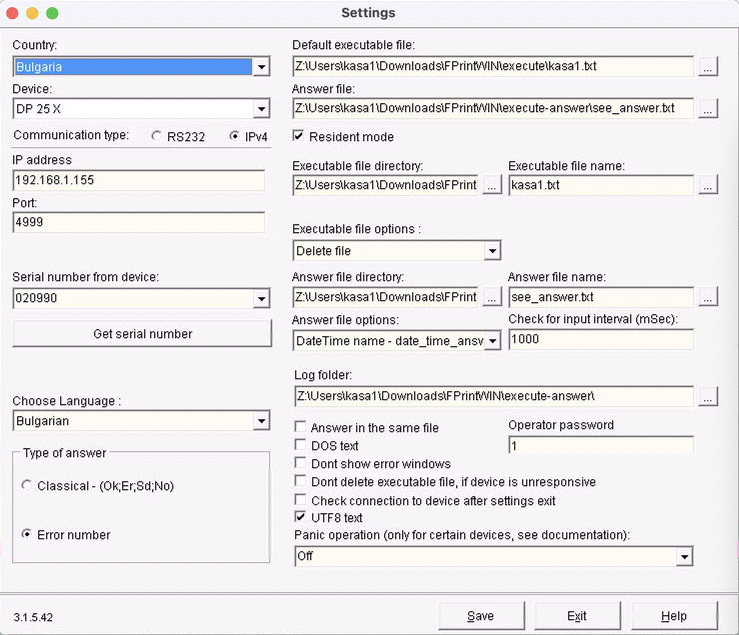

# DatecsFPrint for macOS

[](https://www.apple.com/macos/)
[](https://www.winehq.org/)
[]()
[](LICENSE)

Run Windows **FPrint.exe** on macOS using **Wine** for Datecs fiscal printers. Complete solution with automated file management and real-time monitoring.

---

## ✨ Features

### What's Included ✅
- **Wine + FPrint.exe**: Run Windows FPrint software directly on macOS
- **Resident Mode**: Automatic file-based command processing
- **Chrome Extension**: Auto-organize downloaded `kasa*.txt` files
- **Monitor App**: Real-time status tracking with menu bar integration
- **Full Compatibility**: 100% of FPrint features available
- **Complete Documentation**: Step-by-step setup guide with troubleshooting

### Components

1. **FPrint Software** - Windows fiscal printer driver (runs via Wine)
2. **Chrome Extension** - Automatically moves downloaded kasa files to the correct folder
3. **Monitor App** - macOS menu bar app showing FPrint and printer status
4. **Configuration Tools** - Settings Manager for easy printer setup

---

## 🚀 Quick Start

**IMPORTANT**: Clone this repository to your **Downloads** folder for the Chrome extension to work properly:

```bash
cd ~/Downloads
git clone https://github.com/bulgariamitko/datecs-fprint-macos.git
cd datecs-fprint-macos
```

### Step 1: Install Wine

```bash
# Install Homebrew if you don't have it
/bin/bash -c "$(curl -fsSL https://raw.githubusercontent.com/Homebrew/install/HEAD/install.sh)"

# Install Wine
brew install wine-stable

# Verify installation
wine --version
# Should show: wine-8.0 or newer
```

### Step 2: FPrint Software (Included!)

**Good news:** FPrint software is already included in this repository! 📦

The `FPrintWIN/` folder contains all necessary files:
- `FPrint_SettingsManager.exe` - Configuration tool (run this FIRST)
- `FPrint.exe` - Main printer service (run this SECOND in background)
- All required DLLs and support files

No need to download or install anything else!

### Step 3: Configure FPrint (Settings Manager)

**IMPORTANT:** Run the Settings Manager FIRST to configure your printer.

```bash
# Navigate to repository folder
cd datecs-fprint-macos

# Run FPrint Settings Manager with Wine
wine FPrintWIN/FPrint_SettingsManager.exe
```

**In the Settings Manager window:**
1. Enter your printer's **IP Address** (e.g., `192.168.1.155`)
2. Enter **Port** (usually `4999`)
3. Enter **Device Model** (e.g., `DP-25MX`)
4. Enter **Serial Number** (from printer info menu)
5. Enter **Fiscal Memory Number** (from printer info menu)
6. Set **Execution Folder** (where to watch for commands)
   - **IMPORTANT**: Set this to the `execute` folder inside FPrintWIN
   - Path: `C:\users\{username}\Dropbox\github\datecs-fprint-macos\FPrintWIN\execute`
   - Wine will map this to: `FPrintWIN/execute/`
7. Set **Answer Folder** (where results will be saved)
   - **IMPORTANT**: Set this to the `execute-answer` folder inside FPrintWIN
   - Path: `C:\users\{username}\Dropbox\github\datecs-fprint-macos\FPrintWIN\execute-answer`
   - Wine will map this to: `FPrintWIN/execute-answer/`
8. Click **Save** to save configuration
9. Close the Settings Manager

The settings will be saved to `FPrintWIN/FPrint.ini` and `FPrintWIN/Settings.dat`.



**Why these folders are important:**
- **`execute/`**: FPrint monitors this folder for `.txt` command files to process
- **`execute-answer/`**: FPrint saves response files here after processing commands
- **Error handling**: If there are errors during printing, you'll find error details in the answer files in `execute-answer/`

### Step 4: Verify Folder Structure

The necessary folders are already included in the repository:

```bash
# Verify the folders exist
ls -la FPrintWIN/execute/
ls -la FPrintWIN/execute-answer/
```

**Note:** These folders should match what you configured in Settings Manager (Step 3). FPrint will monitor `execute/` for command files and save responses in `execute-answer/`.

### Step 5: Run FPrint in Resident Mode

Now that configuration is complete, run FPrint.exe in the background:

```bash
# Navigate to repository folder
cd datecs-fprint-macos

# Start FPrint in background (recommended)
nohup wine FPrintWIN/FPrint.exe /resident > /tmp/fprint.log 2>&1 &

# Check if running
ps aux | grep FPrint.exe

# View logs (optional)
tail -f /tmp/fprint.log
```

**Or run in foreground** (to see output directly):
```bash
wine FPrintWIN/FPrint.exe /resident
```

FPrint is now running and monitoring for command files! 🚀

### Step 6: Send Test Command

```bash
# Create a test command file in the execute folder
echo "I,1,______,_,__;0;80" > FPrintWIN/execute/test01.txt

# Wait a moment, then check result in execute-answer folder
cat FPrintWIN/execute-answer/test01.txt
```

If you see a response with printer information, it's working! 🎉

**To stop FPrint:**
```bash
pkill -f FPrint.exe
```

### Step 7: Install Chrome Extension (Optional but Recommended)

The Chrome extension automatically organizes downloaded `kasa*.txt` files by moving them directly to the `execute/` folder.

**Install the extension:**

1. Open Chrome and go to `chrome://extensions/`
2. Enable **Developer mode** (toggle in top-right corner)
3. Click **Load unpacked**
4. Navigate to your Downloads folder and select: `datecs-fprint-macos/chrome-extension/`
5. The extension "Kasa Мениджър за Изтегляния" should now appear in your extensions list

**Configure the extension:**

1. Click the extension icon in Chrome toolbar (puzzle piece → pin the Kasa extension)
2. Click the Kasa extension icon
3. The default path should already be set to: `datecs-fprint-macos/FPrintWIN/execute`
4. Click **"Запази настройките"** (Save Settings)
5. Click **"Тест изтегляне и дебъг"** (Test Download) to verify it works

**How it works:**

- Any file matching the pattern `kasa*.txt` (e.g., `kasa1.txt`, `kasa123.txt`) will be automatically moved to `~/Downloads/datecs-fprint-macos/FPrintWIN/execute/`
- FPrint monitors this folder and processes the files automatically
- Results appear in the `execute-answer/` folder

**Test the full workflow:**

```bash
# Download a test file from a website, or simulate by:
# 1. Download any .txt file
# 2. Rename it to kasa1.txt before saving
# 3. The extension will automatically move it to execute/
# 4. FPrint will process it and create result in execute-answer/

# Check if file arrived in execute folder
ls -la ~/Downloads/datecs-fprint-macos/FPrintWIN/execute/

# Check the result
cat ~/Downloads/datecs-fprint-macos/FPrintWIN/execute-answer/kasa1.txt
```

### Step 8: Install Monitor App (Highly Recommended)

The monitor app is a **macOS menu bar application** that provides real-time monitoring of both FPrint and the fiscal printer connection. This is the **final and most important step** for ensuring everything is working correctly.

**What it monitors:**

1. **FPrint Status** - Checks if `FPrint.exe` is running in the background
2. **Printer Connection** - Verifies network connectivity to the fiscal printer

**Visual Status Indicators:**

- 🟢 **Green Circle** = Both FPrint running AND printer connected = **READY TO PRINT**
- 🟡 **Yellow Circle** = Only one service is working (either FPrint OR printer)
- 🔴 **Red Circle** = Both services are down (FPrint not running AND printer disconnected)

**Install the Monitor App:**

```bash
# The pre-built app is included in the repository
# Simply copy it to your Applications folder
cp -r ~/Downloads/datecs-fprint-macos/monitor-app/dist/FPrintMonitor.app /Applications/

# Launch the app
open /Applications/FPrintMonitor.app
```

**First-time Configuration:**

1. Click the monitor icon in your menu bar (top-right, should show 🟢, 🟡, or 🔴)
2. Click **"Settings"**
3. Enter your printer's IP and port in format: `IP:PORT`
   - Example: `192.168.1.155:4999`
4. Click **"Save"**

**Using the Monitor:**

The menu bar shows:
- **FPrint: ✅ Running** or **❌ Not Running**
- **Printer: ✅ Connected** or **❌ Disconnected**

Available actions:
- **Start FPrint** - Starts FPrint.exe in resident mode if not running
- **Restart FPrint** - Stops and restarts FPrint.exe
- **Settings** - Configure printer IP and port
- **Quit All** - Stops FPrint and closes the monitor app

**Why this is essential:**

- Visual confirmation that everything is working before printing
- Quick troubleshooting - instantly see which component has issues
- Easy FPrint management - start/restart from the menu bar
- **Only print when you see the green circle 🟢** - this ensures both FPrint and the printer are ready

**Auto-start on login (Optional):**

1. Open **System Settings** → **General** → **Login Items**
2. Click the **+** button
3. Select **FPrintMonitor.app** from Applications
4. The monitor will now start automatically when you log in

---

## 📖 Using FPrint via Wine

### Monitor App - Real-Time Status Tracking

The **FPrintMonitor** app is a macOS menu bar utility that continuously monitors your printing system.

**Features:**
- Real-time monitoring every 5 seconds
- Visual status indicators (🟢/🟡/🔴)
- One-click FPrint start/restart
- Configurable printer IP/port settings
- System notifications for state changes
- Auto-start capability on login

**How it works:**

The monitor performs two checks:
1. **FPrint Process Check** - Uses `pgrep` to verify `FPrint.exe` is running
2. **Printer Network Check** - Attempts TCP connection to configured IP:PORT

**Status Logic:**
- Both checks pass → 🟢 Green (ready to print)
- One check passes → 🟡 Yellow (partial failure)
- Both checks fail → 🔴 Red (system down)

**Configuration File:**
Settings are stored in: `~/.config/fprint_monitor/config.json`

**Rebuilding the app (if needed):**

If you want to modify the monitor app:

```bash
cd ~/Downloads/datecs-fprint-macos/monitor-app

# Install dependencies
pip3 install rumps pyinstaller

# Rebuild the app
pyinstaller FPrintMonitor.spec

# The new app will be in dist/FPrintMonitor.app
```

### Chrome Extension for Automated File Management

The included Chrome extension (`chrome-extension/`) automatically organizes downloaded `kasa*.txt` files:

**Features:**
- Monitors all Chrome downloads
- Detects files matching pattern `kasa*.txt` (e.g., `kasa1.txt`, `kasa123.txt`, `kasa.txt`)
- Automatically moves them to the configured folder (default: `Downloads/datecs-fprint-macos/FPrintWIN/execute/`)
- Provides test download functionality
- Debug logging for troubleshooting

**Why use it?**
Without the extension, you'd need to manually move each downloaded `kasa*.txt` file to the execute folder. The extension eliminates this manual step, creating a seamless workflow:

1. Website generates `kasa1.txt` → you download it
2. Extension automatically moves it to `execute/`
3. FPrint processes it immediately
4. Result appears in `execute-answer/`

**Installation** (see Step 7 above for detailed instructions):
- Load unpacked extension from `chrome-extension/` folder
- Configure path in extension popup
- Test with the built-in test download button

**Troubleshooting the extension:**
- Ensure "Ask where to save each file" is **disabled** in Chrome settings
- Check extension has download permissions
- Use the debug logs in the extension popup to see what's happening
- Make sure the repository is in `~/Downloads/` folder

### Starting FPrint

**First time setup:** Run Settings Manager first!
```bash
wine FPrintWIN/FPrint_SettingsManager.exe
# Configure printer, save, close
```

**Then start FPrint:**
```bash
# Foreground (see output)
wine FPrintWIN/FPrint.exe /resident

# Background (recommended)
nohup wine FPrintWIN/FPrint.exe /resident > /tmp/fprint.log 2>&1 &
```

### Stopping FPrint
```bash
# Find and kill the process
pkill -f FPrint.exe

# Or find PID first
ps aux | grep FPrint.exe
kill <PID>
```

### Sending Commands

FPrint works by monitoring a folder for command files. To send commands:

1. **Create a command file** in the `execute/` folder:
   ```bash
   # Example: Get device info
   echo "I,1,______,_,__;0;80" > FPrintWIN/execute/cmd001.txt
   ```

2. **FPrint processes it automatically** and creates a result file in `execute-answer/`

3. **Read the result**:
   ```bash
   cat FPrintWIN/execute-answer/cmd001.txt
   ```

**Important Notes:**
- Command files must be `.txt` files
- After processing, responses appear in `execute-answer/` with the same filename
- If there are errors, error details will be in the answer file

### Common Commands

```bash
# Get device information
echo "I,1,______,_,__;0;80" > FPrintWIN/execute/info.txt
cat FPrintWIN/execute-answer/info.txt

# Get last document number
echo "N,1,______,_,__;" > FPrintWIN/execute/lastdoc.txt
cat FPrintWIN/execute-answer/lastdoc.txt

# Open fiscal receipt
echo "48,1,______,_,__;1;1;1;0;OPERATOR001;" > FPrintWIN/execute/open.txt
cat FPrintWIN/execute-answer/open.txt

# Print text line
echo "54,1,______,_,__;Test Receipt;" > FPrintWIN/execute/print.txt
cat FPrintWIN/execute-answer/print.txt

# Close fiscal receipt
echo "56,1,______,_,__;" > FPrintWIN/execute/close.txt
cat FPrintWIN/execute-answer/close.txt
```

### Automation Script

Create a helper script to send commands easily:

```bash
#!/bin/bash
# save as: fprint-send.sh

# Get the script's directory
SCRIPT_DIR="$( cd "$( dirname "${BASH_SOURCE[0]}" )" && pwd )"
COMMAND_DIR="$SCRIPT_DIR/FPrintWIN/execute"
RESULT_DIR="$SCRIPT_DIR/FPrintWIN/execute-answer"

# Generate unique filename
FILENAME="cmd_$(date +%s).txt"

# Write command
echo "$1" > "$COMMAND_DIR/$FILENAME"

echo "Command sent: $FILENAME"
echo "Waiting for response..."

# Wait for result
sleep 1

# Show result
if [ -f "$RESULT_DIR/$FILENAME" ]; then
    echo "Response:"
    cat "$RESULT_DIR/$FILENAME"
else
    echo "No result yet, check manually in $RESULT_DIR/$FILENAME"
fi
```

**Usage:**
```bash
chmod +x fprint-send.sh
./fprint-send.sh "I,1,______,_,__;0;80"
```

---

## 🔧 Troubleshooting

### Wine Issues

**Wine not found:**
```bash
# Check installation
which wine
wine --version

# Reinstall if needed
brew reinstall wine-stable
```

**Wine configuration:**
```bash
# Open Wine configuration
winecfg

# Set Windows version to Windows 10
# Check drive mappings (C: should exist)
```

### FPrint Issues

**FPrint won't start:**
```bash
# Check for missing DLL errors
wine ~/.wine/drive_c/Program\ Files/Datecs/FPrint/FPrint.exe

# Install dependencies if needed
brew install winetricks
winetricks dotnet40
winetricks vcrun2019
```

**FPrint not processing files:**
- Verify ExecutionFolder in config matches created folder
- Check file permissions (should be readable/writable)
- Check FPrint logs (if any) in FPrint directory
- Ensure FPrint is actually running: `ps aux | grep FPrint`

### Printer Issues

**Can't connect to printer:**
```bash
# Test network connection
nc -zv YOUR_PRINTER_IP 4999

# Or use telnet
telnet YOUR_PRINTER_IP 4999
```

**Connection works but no response:**
- Verify IP in config matches actual printer IP
- Check printer is powered on and in fiscal mode
- Verify printer network settings
- Check firewall (both macOS and printer)
- Confirm port 4999 is correct for your model

### Monitor App Issues

**App won't start:**
```bash
# Check if you have Python dependencies
pip3 list | grep rumps

# If missing, install:
pip3 install rumps
```

**Monitor shows red/yellow when everything should be working:**

1. **Verify FPrint is running:**
   ```bash
   ps aux | grep FPrint.exe
   ```

2. **Verify printer connection:**
   ```bash
   nc -zv YOUR_PRINTER_IP 4999
   ```

3. **Check monitor configuration:**
   ```bash
   cat ~/.config/fprint_monitor/config.json
   ```

4. **Ensure IP/port match your FPrint Settings Manager configuration**

**Monitor says "FPrint not found":**
- Ensure repository is at: `~/Downloads/datecs-fprint-macos/`
- Verify FPrintWIN folder exists with FPrint.exe

**Monitor can start FPrint but shows yellow:**
- Printer connection issue - check IP/port in monitor Settings
- Printer may be powered off or network unreachable
- Try pinging printer: `ping YOUR_PRINTER_IP`

---

## 📁 File Locations Reference

| What | Location |
|------|----------|
| **Repository** | `~/Downloads/datecs-fprint-macos/` |
| FPrint executables | `FPrintWIN/` |
| Settings Manager | `FPrintWIN/FPrint_SettingsManager.exe` |
| FPrint main | `FPrintWIN/FPrint.exe` |
| FPrint config | `FPrintWIN/FPrint.ini`, `FPrintWIN/Settings.dat` |
| Command files | `FPrintWIN/execute/` |
| Result files | `FPrintWIN/execute-answer/` |
| Chrome extension | `chrome-extension/` |
| Monitor app (source) | `monitor-app/unified_monitor.py` |
| Monitor app (built) | `monitor-app/dist/FPrintMonitor.app` |
| Monitor app (installed) | `/Applications/FPrintMonitor.app` |
| Monitor config | `~/.config/fprint_monitor/config.json` |
| Setup screenshots | `screenshots/` |
| Electron app (experimental) | `electron-app/` (not functional) |
| FPrint logs | `/tmp/fprint.log` (if using nohup) |
| Wine C: drive | `~/.wine/drive_c/` |

---

## 📦 Supported Datecs Printers

All Datecs fiscal printers supported by Windows FPrint work via Wine:

| Model Series | Status | Notes |
|--------------|--------|-------|
| **DP-25MX** | ✅ Tested | Fully working via Wine |
| **DP-50X** | ✅ Compatible | Should work (untested) |
| **FP-2000** | ✅ Compatible | Should work (untested) |
| **All Models** | ✅ Compatible | If Windows FPrint supports it |

---

## 🔮 Experimental Work

### Native Protocol Implementation

Long-term experimental goal: eliminate Wine dependency with native protocol implementation.

📁 **See [experimental/native-protocol/](experimental/native-protocol/)** for:
- Protocol decoding work
- Test scripts
- Research notes

**Status**: Experimental, incomplete. Wine-based solution is the recommended approach.

### Electron App

An incomplete Electron + React UI exists in the `electron-app/` folder but is **not functional** and may never be completed. The current Wine-based solution with the monitor app provides all necessary functionality.

📁 **See [electron-app/README.md](electron-app/README.md)** for details.

---

## 📚 Documentation

- **[SETUP_GUIDE.md](SETUP_GUIDE.md)** - Detailed Wine setup instructions
- **[docs/](docs/)** - Technical protocol documentation
- **[experimental/native-protocol/](experimental/native-protocol/)** - Protocol research
- **[CONTRIBUTING.md](CONTRIBUTING.md)** - How to contribute

---

## 🤝 Contributing

We welcome contributions in several areas:

### 1. Documentation
- Improve Wine setup instructions
- Add troubleshooting tips
- Create video tutorials
- Test with different printer models

### 2. Monitor App Enhancements
- Add more status checks
- Improve error reporting
- Add notification preferences

### 3. Protocol Research
- Decode Datecs commands
- Test with different printer models
- Document findings in experimental/native-protocol/

### 4. Electron App (Optional)
- The Electron app in `electron-app/` is incomplete
- Contributions welcome but not prioritized
- Discuss in GitHub issues before investing time

See [CONTRIBUTING.md](CONTRIBUTING.md) for detailed guidelines.

---

## 📄 License

MIT License - see [LICENSE](LICENSE) file for details.

---

## 🙏 Acknowledgments

- **Datecs** for their fiscal printers and FPrint software
- **Wine** project for enabling Windows software on macOS
- **Community** for testing and contributions

---

## 📞 Support

- **Issues**: [GitHub Issues](../../issues) for bugs and problems
- **Discussions**: [GitHub Discussions](../../discussions) for questions
- **Wine Help**: [WineHQ Forums](https://forum.winehq.org/)
- **Datecs Support**: Contact Datecs for printer-specific issues

---

## 🎯 TL;DR - Just Want to Print?

```bash
# 1. Install Wine
brew install wine-stable

# 2. Clone this repository to Downloads folder
cd ~/Downloads
git clone https://github.com/bulgariamitko/datecs-fprint-macos.git
cd datecs-fprint-macos

# 3. Run Settings Manager (configure your printer)
wine FPrintWIN/FPrint_SettingsManager.exe
# Enter IP, port, model, serial, etc.
# Set Execution Folder to: FPrintWIN/execute
# Set Answer Folder to: FPrintWIN/execute-answer
# Save → Close

# 4. Verify folders exist
ls -la FPrintWIN/execute/
ls -la FPrintWIN/execute-answer/

# 5. Start FPrint in background
nohup wine FPrintWIN/FPrint.exe /resident > /tmp/fprint.log 2>&1 &

# 6. Send test command
echo "I,1,______,_,__;0;80" > FPrintWIN/execute/test.txt

# 7. Check result
cat FPrintWIN/execute-answer/test.txt
```

**Optional but Recommended - Chrome Extension:**
1. Open Chrome → `chrome://extensions/`
2. Enable Developer mode
3. Load unpacked → select `chrome-extension/` folder
4. Configure path: `datecs-fprint-macos/FPrintWIN/execute`
5. Now any downloaded `kasa*.txt` files auto-move to execute folder!

**Highly Recommended - Monitor App:**
1. Copy to Applications: `cp -r ~/Downloads/datecs-fprint-macos/monitor-app/dist/FPrintMonitor.app /Applications/`
2. Launch: `open /Applications/FPrintMonitor.app`
3. Configure printer IP:PORT in Settings
4. 🟢 = Ready to print | 🟡 = Partial failure | 🔴 = System down
5. Only print when you see green circle!

**That's it!** FPrint software, Chrome extension, and monitor app included - complete solution! 🎉

---

**Questions? Problems?** [Open an issue](../../issues) and we'll help!
